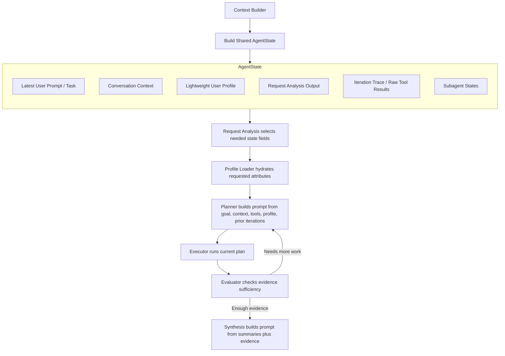

# Context Assembly
The right mental model is not "we build one giant context blob and pass it everywhere." What we actually do is build a shared `AgentState`, and then each prompt-building step pulls the specific sections it wants from that state.

## AgentState First
At the start of a turn we assemble a reusable `AgentState` that can hold:
1. The latest user prompt as the active task.
2. Conversation context, including top-level summaries and recent roundtrip history.
3. A lightweight user profile with geo/location-aware metadata.
4. Request-analysis output such as the refined goal, applicable tool categories, and requested attribute types.
5. Iteration state, including plans and raw tool results gathered so far.
6. Subagent state for secondary agent paths such as profile management.
7. Final result fields, logs, and runtime data needed across the graph.

That gives the graph one shared runtime picture of the turn without forcing every prompt to receive every field.

## Conversation Context Layer
`build_roundtrip_context(...)` currently builds `ConversationContext` from four layers:
1. `conversation.summary` as the top-level conversation summary.
2. The latest stored batch summary as `latest_conversation_summary`.
3. Recent roundtrips after the latest summary cutoff, each with `user_prompt` and `roundtrip_summary`.
4. Recent roundtrip tool summaries after the latest summary cutoff.

Important detail:
1. The current user prompt is not embedded into stored conversation context.
2. We create the roundtrip row early, but context assembly only includes roundtrips that already have a `user_prompt` or `roundtrip_summary`.
3. The live user request is passed separately as `state.task`.

## Profile Hydration Layer
We also prepare a separate `User Profile` object inside state.

That profile starts with lightweight durable identity and geometadata. Stored user attributes are then loaded in stages:
1. `request_analysis` sees the lightweight profile, not the full durable attribute set.
2. It requests specific attribute types such as `food.likes` or `projects.goals` when they would materially help.
3. `load_user_profile` hydrates only those requested attribute types into the profile.
4. Later steps use that hydrated profile slice instead of preloading everything.

Tone also follows this selective pattern:
1. It is not included by default everywhere.
2. Planning includes tone so the planner can see available user communication preferences.
3. Synthesis includes tone so the final response can match the user's preferred style.

## Prompt Assembly Per Step
After shared state exists, each prompt is built from the smallest useful slice of it.

### Request Analysis
`request_analysis` gets:
1. The latest user prompt.
2. Conversation context.
3. Lightweight user profile metadata.
4. Available tool categories.

Its job is to produce a self-contained goal plus any needed tool categories and requested durable attribute types.

### Profile Loading
`load_user_profile` is not an LLM prompt step.

It uses the request-analysis output in state to hydrate only the requested durable attribute types before later prompts run.

### Planner
The planner currently gets:
1. A goal built from `request_analysis.goal` or the latest task.
2. Conversation context.
3. The hydrated user profile, including tone.
4. Allowed tools and planner rules.
5. Previous iterations with raw step results.

So the planner is not working from the full raw conversation transcript, but it does currently receive structured conversation context.

### Executor
The executor does not build an LLM planning prompt.

It uses the current plan plus accumulated state to execute tool calls and store raw results keyed by canonical step IDs.

### Evaluator
The evaluator sits between execution and synthesis.

It gets:
1. The goal.
2. The latest user prompt.
3. The user profile.
4. Prompt-safe evidence views derived from execution results.

Its job is to decide whether the current evidence is sufficient, whether another meaningful planning pass is needed, or whether the loop should terminate.

### Synthesis
Synthesis currently gets:
1. The latest user prompt.
2. A narrowed conversation context containing only `conversation_summary`, `latest_conversation_summary`, and the latest stored `tool_summary`.
3. The user profile, including tone.
4. Prompt-safe evidence views derived from execution results.

Important detail:
1. Synthesis does not currently receive `recent_roundtrips`.
2. Synthesis does not receive planner-history payloads.
3. Synthesis works from the narrowed summaries plus evidence.

## Evidence Model
Execution now keeps raw step results in iteration trace, and prompt-facing evidence is derived separately from that raw data.

The practical split is:
1. Raw step results stay useful for execution, logging, persistence, and planner history.
2. Hydrated evidence is normalized for application-side lookup and source rendering.
3. Evidence views are the smaller prompt-safe records passed to evaluator and synthesis.

## Overall Flow
In practice the flow is:
1. Build `AgentState`.
2. Run request analysis.
3. Hydrate the requested slice of the user profile.
4. Plan and execute.
5. Evaluate whether another planning pass is needed.
6. Synthesize from narrowed context plus evidence.

Simple diagram to illustrate the shape of the flow:

