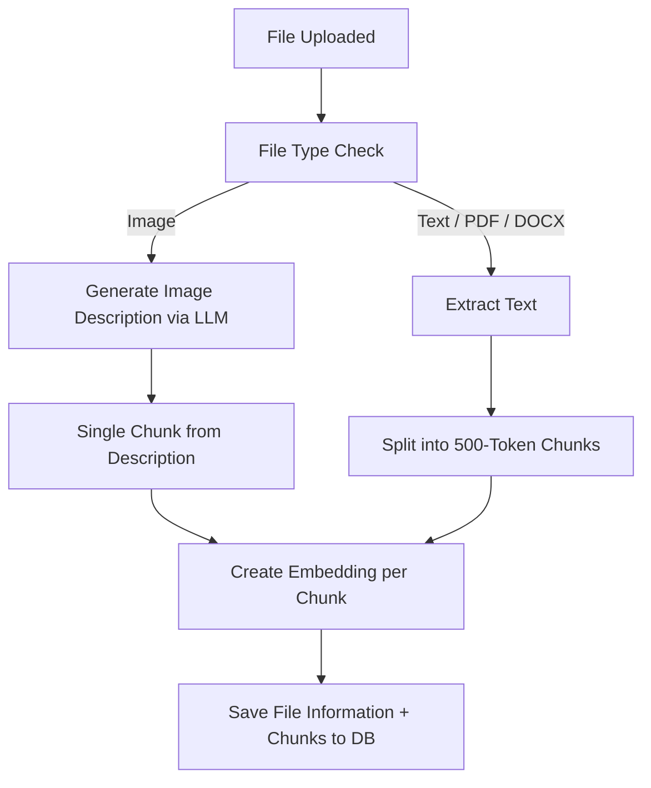

# File Searching
The implementation is fairly simple. It's intentionally not async to keep things simple, but one could imagine that at scale you would want to make part of the processing async. The idea for what happens with file uploads/searches is explained in the diagram below, but essentially:
1. Files are uploaded and chunked into 500-token-sized chunks and embeddings are created.
2. When the file tools are utilized, we convert the query into an embedding and perform an embedding search to find chunks which are semantically close to the data we are looking for. For images we generate a description of the image with an LLM and then generate an embedding for that description. This way we can allow for easy contextual searches of images as well.

